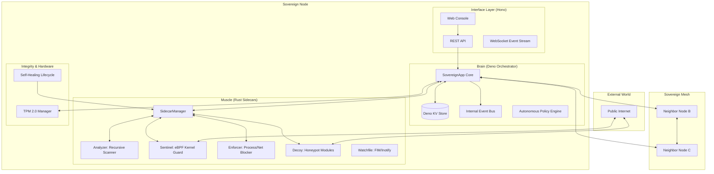

# Sovereign Security Orchestrator: System Architecture

The Sovereign Security Orchestrator (Counter-Terrorist) is a high-performance, distributed security mesh designed for autonomous system defense and forensic visibility. It follows a **Brain-and-Muscle** pattern, separating high-level policy coordination from low-level system enforcement.

## 1. System Topology

---

## 2. Key Architectural Components

### 2.1. The Brain: Deno Orchestrator
The core logic resides in a Deno-based orchestrator. It is responsible for:
- **State Management:** Using Deno KV for persistent storage of sessions, audit logs, and discovery data.
- **Policy Enforcement:** An autonomous engine that translates high-level security requirements into specific agent commands.
- **Event Mediation:** Centralized routing of forensic events (e.g., a honeypot hit triggering a PCAP capture and an eBPF block).

### 2.2. The Muscle: Rust Sidecars
Rust-based agents perform the heavy lifting. They communicate with the Brain via **Secure IPC** (JSON-over-stdin/stdout).
- **Hardened Execution:** Sidecars are deployed into a root-owned jail (`/var/lib/cts/bin`) with granular **Linux Capabilities** (e.g., `CAP_NET_ADMIN`), minimizing the need for full `sudo` access.
- **Cyclic Rotation:** Agents are periodically terminated, re-verified against a signed manifest, and re-spawned to neutralize memory-resident exploits.

### 2.3. The Mesh: Distributed Intelligence
Nodes form a peer-to-peer mesh using a secure gossip protocol.
- **Threat Sharing:** If Node A detects a malicious binary hash or IP, it broadcasts this "Tactical Intelligence" to the mesh.
- **Verified Gossip:** All mesh communications are signed with HMAC using a shared `MESH_SECRET`, ensuring only verified nodes can influence system policy.

### 2.4. Hardware Integrity (TPM)
The system leverages **TPM 2.0** for a "Root of Trust."
- **PCR Verification:** At boot, the orchestrator verifies system integrity by comparing current PCR values against "Golden Baselines."
- **Emergency Lockdown:** If hardware integrity is compromised and no secure bypass is present, the system enters a fail-shut "Lockdown" state, preserving forensic evidence and cutting network access.

---

## 3. Communication Patterns

### 3.1. Brain-to-Sidecar (IPC)
Requests are validated against strict Zod schemas before being serialized to JSON and sent to the agent's `stdin`. Responses are captured from `stdout` and mapped back to the original request using a unique UUID.

### 3.2. Sidecar-to-Brain (Events)
Agents can emit asynchronous events (e.g., a process starting, a packet captured). These are tagged with `[LOG]` or standard JSON, ingested by the `SidecarManager`, and published to the orchestrator's internal `EventBus`.

### 3.3. Web Interface (Hono)
A modern reactive UI provides real-time visibility. It uses:
- **Server-Side Rendering (JSX):** For core navigation and layouts.
- **Web Components (Islands):** For real-time tactical displays (Process Trees, Signal Matrix, Forensic Logs).
- **Hardened Middleware:** Enforces CSRF protection, API rate limiting, and RBAC roles (Admin, Operator, Viewer).

---

## 4. Security Solutions

- **Defense in Depth:** Hardware -> Kernel (eBPF) -> Userland (Agents) -> Mesh.
- **Self-Healing Infrastructure:** Automated restoration of deleted or modified binaries from a secure golden repository.
- **Deception Grid:** Integrated honeypots that proactively engage and sabotage attackers via the "Breaker" protocol.
- **Path Jailing:** Centralized validation prevents agents from accessing sensitive system files outside of defined operational boundaries.
