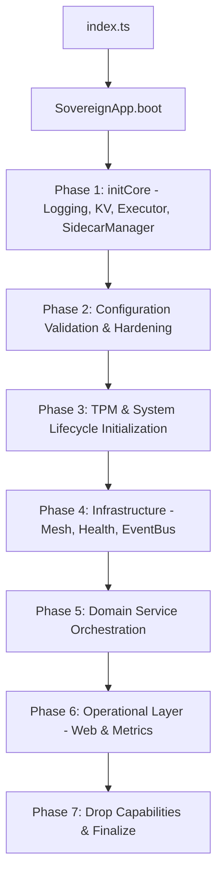

# Architecture Deep Dive: Sovereign Security Orchestrator

## 1. System Overview
The Sovereign system is an autonomous security orchestrator built with a "Defense in Depth" philosophy. It leverages Deno's secure runtime for the control plane and native Rust sidecars for high-performance system enforcement.

### 1.1 Three-Tier Architecture
- **Web Interface (Hono/JSX)**: The management ingress providing a tactical dashboard and real-time telemetry via WebSockets.
- **Orchestrator Core (Deno)**: The "Brain" implementing Domain-Driven Design (DDD). It coordinates between various security domains (Identity, Protection, Analysis, Engine).
- **Enforcement Agents (Rust Sidecars)**: Low-level native processes that interface with the OS (eBPF, Netlink, UFW, TPM).

## 2. Execution Flows

### 2.1 Boot Sequence (Critical Path)
The `SovereignApp` boot sequence is a multi-phase initialization designed to ensure system integrity before enabling network interfaces.

### 2.2 Request Lifecycle
All API requests undergo strict mediation through the `WebAdapter` pipeline.

1. **Deception Check**: Requests hitting honey-routes are trapped before auth.
2. **Hardened Headers**: CSP, HSTS, and Frame-Options applied.
3. **Authentication**: Session cookie, Bearer token, or API Key validation.
4. **CSRF Enforcement**: `X-CT-Token` check for mutation methods.
5. **Domain Execution**: Controller invokes relevant Domain Service (e.g., `ForensicService`).
6. **Sidecar IPC**: Domain Service sends validated JSON commands via `SystemExecutor`.
7. **Audit Trail**: Sensitive actions are cryptographically signed and logged to the forensic ledger.

## 3. Dependency Mapping
The system uses a `ServiceContainer` for dependency injection, ensuring components are decoupled and testable.

| Domain | Key Services | Responsibility |
| :--- | :--- | :--- |
| **Identity** | `MeshAuth`, `Session`, `ApiKeys` | mTLS, RBAC, and Token management. |
| **Protection** | `Firewall`, `Vpn`, `Honeypot`, `Canary` | Active defense and deception. |
| **Analysis** | `Audit`, `Forensics`, `ProcessTracker` | Observability and evidence collection. |
| **Engine** | `Autopilot`, `Playbook`, `Policy` | Autonomous response and orchestration. |

## 4. Trust Boundaries & Isolation

### 4.1 Internal IPC (Shared Memory & Stdio)
Communication between Deno and Rust sidecars uses a tiered approach:
- **Shared Memory Data Plane**: High-frequency telemetry uses a Zero-Copy Ring Buffer in `/dev/shm` with SIMD-accelerated obfuscation.
- **Control Plane**: Stdio pipes or shared memory slots for command-and-control.
- **Validation**: `validateRequest` and `validateResponse` schemas (Zod) enforce strict structural integrity.
- **Tiered Timeouts**: High-priority remediation commands (e.g., `KillProcess`, `BlockIp`) timeout in 5 seconds to prevent orchestrator blocking, while standard commands allow 60 seconds.
- **Jailing**: `SystemExecutor` enforces mandatory path jailing for all sidecar commands.

### 4.2 Mesh Connectivity (mTLS)
Node-to-node communication is secured via a private PKI.
- **Root CA**: Generated and stored securely in Deno KV (optionally sealed to TPM).
- **Node Certs**: Each node possesses a unique X.509 certificate signed by the Mesh Root.
- **HMAC Signatures**: Mesh gossip payloads are signed with `MESH_SECRET` to prevent tampering.

## 5. Scalability Considerations
- **Event Bus**: Utilizes `safelyExecute` with async handlers to prevent listener-blocking.
- **Metrics Collection**: Staggered cycles (5s, 15s, 30s) reduce periodic resource spikes.
- **Deno KV**: Handles state persistence with optimistic concurrency.

## 6. Critical Path Analysis: Autopilot Remediation
1. **Trigger**: `Sentinel` (Rust) emits a `SYSCALL_EVENT` via stdout.
2. **Ingestion**: `SidecarManager` parses JSON and emits a Deno event.
3. **Mediation**: `EventMediator` processes syscall and calculates behavioral anomaly score.
4. **Evaluation**: `AutopilotService` receives `EBPF_CRITICAL` event.
5. **Policy**: `PolicyEngine` maps threat score to `BLOCK` action.
6. **Enforcement**: `ProtectionAdapter` instructs `Sentinel` to block the malicious PID/IP.
7. **Audit**: The entire chain is logged to the forensic ledger.
